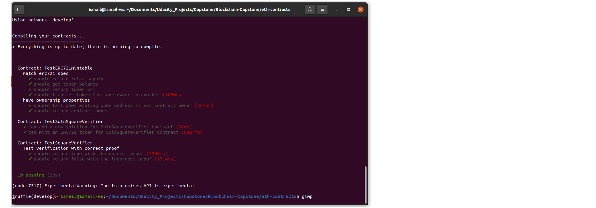

# Udacity Blockchain Capstone

The capstone will build upon the knowledge you have gained in the course in order to build a decentralized housing product. 

## Install
The repository contains Smart Contract code written solidity and tests using Javascript. To run the code:
* npm install
* Truffle Compile (use npx truffle compile if there are issues compiling to use local version of truffle)

## Package versions:
* Truffle v5.0.15 (core: 5.0.15)
* Solidity - 0.5.2 (solc-js)
* Node v10.15.3
* Web3.js v1.5.3

## Generating proof with zokrates
* Navigate to folder zokrates\code\
* Run zokrates docker image docker run -v $(pwd):/home/zokrates/code -it zokrates/zokrates:0.3.0 /bin/bash
* compile the program
  cd code
  ~zokrates compile -i square/square.code
* Generate the trusted setup ~/zokrates setup

* Compute witness for your desired pair of number ~/zokrates compute-witness -a 10 100

* Generate proof ~/zokrates generate-proof

* Generate verifier.sol ~/zokrates export-verifier

## Pass Truffle Test using local development blockchain

## Deployed contract address (Verifier) on Rinkeby Testnet
0x2D1754ea4126293d4b6baACC7469A71bbc5420c4

## Deployed contract address (SolnSquareVerifier) on Rinkeby Testnet
0xac7df8cc27e5b1a9b570e1710d2699634cc53a6f

## Owner address
0x501f478159D380Fa97fC05dc8c4373BF9352Acd5

## Minting 5 tokens
Note that 5 tokens have been directlty minted upon contract deployment in 2_deploy_contracts.js migration file.

## Contract ABIs
contract ABI can be found in the following folder: eth-contracts/build/contracts

## Items listed on opensea
https://testnets.opensea.io/collection/erc721mintabletoken-w2oefawqwa

## Individual items listing
https://testnets.opensea.io/assets/0xac7df8cc27e5b1a9b570e1710d2699634cc53a6f/1
https://testnets.opensea.io/assets/0xac7df8cc27e5b1a9b570e1710d2699634cc53a6f/2
https://testnets.opensea.io/assets/0xac7df8cc27e5b1a9b570e1710d2699634cc53a6f/3
https://testnets.opensea.io/assets/0xac7df8cc27e5b1a9b570e1710d2699634cc53a6f/4
https://testnets.opensea.io/assets/0xac7df8cc27e5b1a9b570e1710d2699634cc53a6f/5

## Buying NFT
* Buyer: 0x324766a8290260881e7F2d1c6d97986D1Fc8EACF
* Seller: 0x501f478159D380Fa97fC05dc8c4373BF9352Acd5
* Offer was made at 0.1WETH for NFT at index 1
* Purchase history can be seen on opensea: https://testnets.opensea.io/assets/0xac7df8cc27e5b1a9b570e1710d2699634cc53a6f/1

# Project Resources

* [Remix - Solidity IDE](https://remix.ethereum.org/)
* [Visual Studio Code](https://code.visualstudio.com/)
* [Truffle Framework](https://truffleframework.com/)
* [Ganache - One Click Blockchain](https://truffleframework.com/ganache)
* [Open Zeppelin ](https://openzeppelin.org/)
* [Interactive zero knowledge 3-colorability demonstration](http://web.mit.edu/~ezyang/Public/graph/svg.html)
* [Docker](https://docs.docker.com/install/)
* [ZoKrates](https://github.com/Zokrates/ZoKrates)

